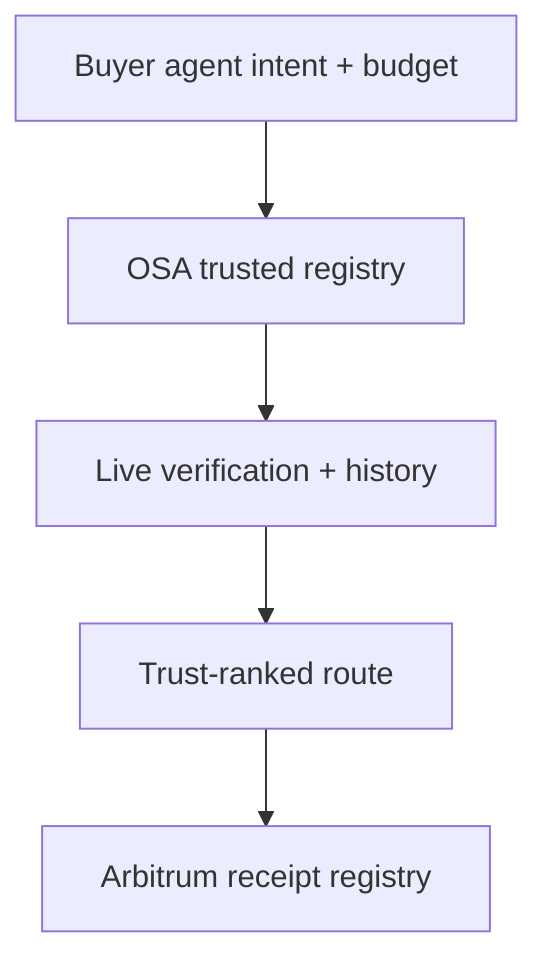

# OSA Safe Router — Arbitrum Open House Singapore

Status date: 2026-08-26  
Submission status: prepared, not yet registered or submitted  
Deployment status: contract compiled and tested locally; Arbitrum Sepolia address and transaction are pending

## Submission facts

- Event: Arbitrum Open House Singapore: Online Buildathon
- Organizer: Arbitrum Foundation
- Format: online
- Registration window: 2026-07-29 17:01 through 2026-10-02 17:01
- Submission window: 2026-09-13 17:01 through 2026-10-04 15:59
- Reward announcement: 2026-10-12 06:00
- Total listed pool: 115,000 USDC
  - Overall: 70,000 USDC (40,000 / 20,000 / 10,000)
  - Promising Products: 15,000 USDC (7,000 / 5,000 / 3,000)
  - Milestone-based grants: up to 30,000 USDC, discretionary and not guaranteed
- Eligibility gate: deploy the project on an Arbitrum chain.
- Existing projects are allowed.
- Published judging criteria: smart-contract quality, product-market fit, innovation and creativity, and solving a real problem.

Official references checked on 2026-08-26:

- [HackQuest event page](https://www.hackquest.io/hackathons/Arbitrum-Open-House-Singapore-Online-Buildathon)
- [Arbitrum Foundation announcement](https://blog.arbitrum.foundation/builders-block-023-415k-in-prizes-at-open-house-singapore-apply-now/)
- [Arbitrum developer documentation](https://docs.arbitrum.io/)

Prize money is conditional on judging and, where stated, development milestones. It must not be recorded as revenue unless actually received and independently verified.

## Paste-ready project profile

Project name: **OSA Safe Router**

Tagline: **Verifiable trust receipts for autonomous API purchases on Arbitrum.**

Category targets: **Overall Prize** and **Promising Products Track**

Technology: **Solidity, Node.js, viem, x402, Arbitrum Sepolia**

Repository: **https://github.com/omarfff/OSA**

Team lead: **Omar Saad**  
Team composition: **Confirm before submission; do not infer additional members.**

Short description:

> OSA Safe Router verifies and ranks paid APIs and agent tools before an autonomous buyer spends money, then anchors a privacy-preserving receipt of the routing decision on Arbitrum.

Full description:

> AI agents increasingly purchase APIs, MCP tools and other machine services without a human checking every transaction. Existing payment rails can settle the purchase, but they do not answer the pre-transaction question: which provider is reliable right now, within budget, and unchanged since the last successful use?
>
> OSA Safe Router combines live, read-only endpoint verification with historical evidence. It scores uptime, latency, price stability, schema stability, payment stability and transaction evidence, then returns the best eligible provider with confidence and reason codes. The new Arbitrum integration converts that decision into canonical evidence, hashes it with keccak256 and records a chain-bound receipt through OSARouteRegistry.
>
> Full evidence remains offchain, while Arbitrum stores only the provider commitment, evidence hash, score, confidence, observation time and reporter. This creates a durable audit trail without publishing commercially sensitive endpoint data. A later dispute or evaluation can reproduce the canonical evidence hash and verify that the decision existed at the recorded time.
>
> OSA is not another payment token or generic agent marketplace. It is the trust and procurement layer immediately before machine spend. Arbitrum provides the low-cost, public verification layer for those routing decisions.

## Problem and user

Primary user: an AI agent, orchestration platform or treasury policy engine that must choose among multiple paid endpoints.

Current failure mode:

1. Catalog metadata says an API exists.
2. A payment rail says how to pay it.
3. Neither proves that the endpoint is live, still matches its schema, still charges the expected amount or has enough evidence to justify autonomous spend.
4. When a bad route is chosen, there is no neutral commitment showing what evidence drove the decision.

OSA closes that gap before payment and makes the decision auditable after it.

## Product flow

1. The buyer requests a capability and optional maximum price.
2. OSA filters trusted registry entries and performs bounded, read-only live verification.
3. OSA ranks candidates using TrustScore and confidence.
4. `/route` returns the winner, alternatives, full canonical evidence and an Arbitrum commitment.
5. The reporter records the commitment on Arbitrum Sepolia.
6. Anyone holding the evidence can recompute the hash and verify the receipt.

## What is onchain

`OSARouteRegistry` records:

- `decisionId`: chain-bound hash of the provider, score, confidence, evidence hash and observation time;
- `receiptId`: hash of the decision and reporter, preventing receipt-credit squatting;
- `providerId`: hash of the endpoint method and URL;
- `evidenceHash`: keccak256 of canonical JSON evidence;
- score and confidence, each limited to 0–100;
- observation and recording timestamps;
- reporter address.

Full URLs, response payloads, schemas and commercial evidence stay offchain. The contract is non-payable, ownerless and has no upgrade or administrative mutation path.

## Buildathon work versus pre-existing work

Pre-existing OSA capabilities:

- endpoint normalization and trusted ingestion;
- live read-only verification;
- SSRF, DNS-rebinding and response-bound protections;
- trust scoring, confidence and reason codes;
- historical snapshots;
- optional x402 payment middleware.

Created for the Arbitrum build:

- `contracts/OSARouteRegistry.sol`;
- canonical evidence and EVM-compatible hashing in `src/arbitrum.js`;
- `GET /route` with Arbitrum receipt calldata;
- Arbitrum Sepolia compile, deploy and record scripts;
- contract/interface, deterministic hashing, API discovery and chaos tests;
- this submission and demo package.

This disclosure should remain in the final submission because the event explicitly allows existing projects and judges should be able to distinguish the new Arbitrum work.

## Judging-criteria mapping

| Criterion | Evidence in OSA Safe Router |
|---|---|
| Smart-contract quality | Ownerless, non-payable registry; custom errors; bounded scores; future-time limit; reporter-bound receipts; optimized Solidity build; ABI/calldata tests |
| Product-market fit | Clear buyer: autonomous agents and platforms selecting paid APIs/MCP tools before spend |
| Innovation | Adds reproducible pre-purchase evidence to payment rails; stores commitments rather than sensitive endpoint data |
| Real problem | Prevents agents from paying degraded, drifted or unexpectedly priced providers and preserves an audit trail |

## Security position

- Verification supports only read-only `GET` and `HEAD` targets.
- Private, loopback, link-local and documentation IP ranges are rejected.
- Redirect targets and DNS results are revalidated.
- Time, byte, candidate and concurrency limits prevent unbounded work.
- The contract cannot receive or transfer funds.
- No secret, private key or mnemonic belongs in the repository, submission form or demo recording.
- A receipt proves that a reporter anchored a particular evidence hash; it does not prove the truth of undisclosed evidence by itself. Verification requires the canonical evidence returned by OSA.

## Verification snapshot

- Baseline before Arbitrum changes: 51/51 tests passed.
- Current suite: 60/60 tests passed.
- Chaos suite: 7,500 iterations passed, including 500 unique route commitments.
- Solidity: compiled with solc 0.8.36, optimizer enabled, Paris EVM target.
- Deployed contract: `PENDING_ARBITRUM_SEPOLIA_DEPLOYMENT`
- Deployment transaction: `PENDING_ARBITRUM_SEPOLIA_TRANSACTION`
- Example route transaction: `PENDING_ARBITRUM_SEPOLIA_TRANSACTION`
- Demo video: `PENDING_RECORDING`

## Submission gate

Do not mark the project submitted until every item below is real and verified:

- [x] Arbitrum contract source exists and compiles.
- [x] Offchain commitment and contract calldata are deterministic and tested.
- [x] Existing OSA tests still pass.
- [x] Submission copy and demo plan are ready.
- [ ] HackQuest account is securely authenticated.
- [ ] Buildathon registration is completed.
- [ ] `OSARouteRegistry` is deployed on Arbitrum Sepolia.
- [ ] Contract address and Arbiscan transaction are inserted above.
- [ ] One end-to-end route receipt is recorded and verified.
- [ ] Demo video is recorded and linked.
- [ ] Final HackQuest form is reviewed and explicitly approved before submission.

## Product milestones if selected

1. Integrate signed evidence bundles and third-party reporter attestations.
2. Add an Arbitrum dashboard that verifies evidence against receipt events.
3. Connect x402 purchase outcomes to post-transaction reliability history without counting test payments as revenue.
4. Pilot with one external agent platform and measure failed-spend avoidance, repeat use and paid conversion.
5. Publish a stable receipt schema and SDK for other agent frameworks.
